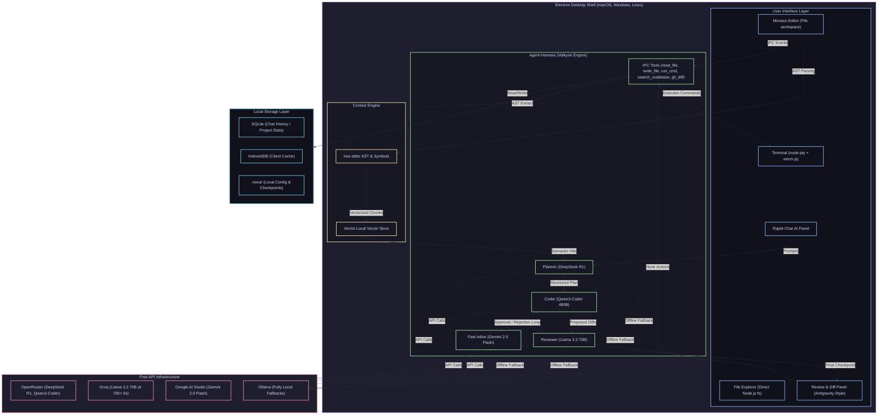

# 🌌 NOVA IDE — The Zero-Cost, Multi-Agent AI Editor

<div align="center">
  
  
  
  
</div>

<br />

> **NOVA** is a lightning-fast, highly extensible, desktop-native code editor designed to deliver the premium multi-agent intelligence of elite editors like Cursor, but built entirely on **100% free models and local orchestration**. 
> 
> By running a local desktop shell around the VS Code Monaco editor, packing local files using Tree-sitter AST, and utilizing a specialized multi-agent orchestrator (**The Valkyrie Harness**), NOVA punches far above the weight of standard free LLM tiers by making specialized models collaborate, self-correct, and review code inside a unified environment.

---

##  Architecture & System Topology

NOVA leverages a multi-tiered architecture to achieve deep filesystem integration, local state management, vector-based semantic retrieval, and low-latency agent streaming.



---

##  Core Product Offerings

### 1. Zero-Cost Multi-Agent Orchestration (The Valkyrie Harness)
Instead of relying on a single expensive model (e.g., GPT-4o or Claude 3.5 Sonnet) that costs $20/month, NOVA orchestrates a cohort of specialized, free LLMs inside a local feedback loop.
*   **Planner (DeepSeek R1):** Deconstructs raw user instructions into detailed, structured execution specifications.
*   **Coder (Qwen3-Coder 480B):** Receives the context and the plan, then writes surgical file modifications.
*   **Reviewer (Llama 3.3 70B):** Acts as a high-speed quality controller, validating diffs and returning detailed issues back to the Coder for up to 3 self-correction iterations.
*   **Fast Inline (Gemini 2.0 Flash):** Powers real-time single-line code completion and micro-queries with sub-100ms latency.

### 2. Antigravity-Style Diff & Review Panel
No more blindly letting AI overwrite your files. NOVA incorporates a state-of-the-art inline diff experience.
*   **Interactive Monaco Diffs:** Uses Monaco's native double-pane and inline diff editors with crystal-clear red/green highlight hunks.
*   **Granular Acceptance:** Accept, reject, or manually edit code hunks individually before writing changes to disk.
*   **Git-Style Snapshots:** Every agent intervention creates a localized snapshot under `.nova/checkpoints/` so you can revert any AI action instantly.

### 3. Astro-Fast Context Packing & Local Vector Search
To avoid blowing past model context limits and hitting rate ceilings, NOVA parses codebases surgically.
*   **Tree-sitter Integration:** Extracts symbolic maps (classes, functions, import trees) directly from your opened workspace.
*   **Local Vector DB (Vectra/ChromaDB):** Embeds and indexes your files locally using lightweight local models (`@xenova/transformers` or local Nomic Embed via Ollama).
*   **Semantic Recall:** Automatically attaches relevant files, adjacent import signatures, and test cases directly to agent prompts without human configuration.

---

##  Technological Blueprint

| Architectural Layer | Technology Stack | Purpose & Integration |
| :--- | :--- | :--- |
| **Desktop Shell** | Electron 31 + Vite + React 18 + TS | High-performance container binding Web views to Node native APIs. |
| **Code Editor Engine** | Monaco Editor | VS Code's editor core, configured with native language workers. |
| **Terminal Integration** | `xterm.js` + `node-pty` | Hardware-accelerated terminal emulator spawned inside host OS. |
| **Embedded Chat UI** | Forked Rapid-Chat (React 19) | Multi-model chat sidebar, modified to use local SQLite backend. |
| **Agent Orchestrator** | Custom TypeScript Harness | Multi-agent state manager executing the Planner ➔ Coder ➔ Reviewer cycle. |
| **Context Indexing** | WebAssembly Tree-sitter | Fast client-side AST generation for selective code ingestion. |
| **Vector Database** | `Vectra` (Pure JS) / ChromaDB | Local vector store holding embeddings of code chunks. |
| **AI Connections** | OpenRouter + Groq + Google AI Studio | Standard HTTPS API pipelines executing custom tool-calling templates. |
| **Offline Engine** | Local Ollama Instance | Fully local fallback models, offering zero-API key coding offline. |
| **Build & Release** | `electron-builder` + `keytar` | Secure binary compilation (DMG/EXE/AppImage) and keychain storage. |

---

##  15-Week Product Implementation Plan

NOVA is developed in six highly structured phases. Below is the comprehensive timeline for engineering completion.

```
[Phase 1] ▬▬▬ [Phase 2] ▬▬▬ [Phase 3] ▬▬▬ [Phase 4] ▬▬▬ [Phase 5] ▬▬▬ [Phase 6]
Weeks 1-3     Weeks 4-5     Weeks 6-9     Weeks 10-11   Weeks 12-13   Weeks 14-15
```

###  Phase 1: Foundation (Weeks 1–3) — The Desktop Shell & Monaco Editor
**Objective:** Establish a robust Electron workspace that boots Monaco, renders the local directory, and runs a native terminal.

*   [ ] **Week 1: Shell Scaffolding & Native Bridge**
    *   Initialize project structure using `electron-vite` in non-interactive mode.
    *   Write safe, multi-process IPC bridges in `preload.js` with strictly scoped contexts.
    *   Expose core operating system APIs (`read_file`, `write_file`, `list_dir`, `watch_file`) to the renderer process.
*   [ ] **Week 2: Monaco Editor Integration & Tabs System**
    *   Embed the Monaco Editor into the primary renderer view.
    *   Configure Monaco Language Workers for multi-threaded syntax highlighting across 50+ languages.
    *   Build a virtual tab manager matching workspace URIs (`file:///...`) to Monaco editor models.
*   [ ] **Week 3: File Explorer Panel & Native Terminal**
    *   Develop a reactive, virtualized sidebar file-tree utilizing Node.js `fs` watches.
    *   Integrate `xterm.js` and spawn virtual terminals via `node-pty` in the Electron main process, sharing shell environments.
    *   Verify cross-platform hotkeys (Open Project, Save File, Toggle Terminal).

---

###  Phase 2: AI Sidebar Integration (Weeks 4–5) — Embedding Rapid-Chat
**Objective:** Adapt the high-performance Rapid-Chat interface into a native panel connected to local persistence.

*   [ ] **Week 4: Stripping Rapid-Chat & Local Migration**
    *   Fork Rapid-Chat, isolating the UI components, Groq/OpenRouter streaming pipelines, and model selectors.
    *   Remove Convex server integrations, replacing the storage layer with a local client-side state adapter.
    *   Embed the cleaned React app directly within the Electron layout.
*   [ ] **Week 5: SQLite Storage & Context Injection Hook**
    *   Install `better-sqlite3` inside the main process to handle chat histories, storing them locally under `.nova/history.db`.
    *   Implement the core context collection hook: before transmitting any user prompt, query the renderer for:
        1. Current open file relative path.
        2. Active selection text hunks.
        3. Precise cursor cursor position.
    *   Inject this state seamlessly as system prompt extensions.

---

###  Phase 3: The Valkyrie Agent Harness (Weeks 6–9) — Orchestrator Core
**Objective:** Architect the multi-agent decision engine that parses, plans, codes, and self-reviews.

```
       [User Prompt]
             │
             ▼
     [DeepSeek R1 Planner] ➔ Generates Structured Action Plan
             │
             ▼
    [Qwen-Coder Coder] ➔ Writes Surgical Code Changes (Diffs)
             │
      ┌──────┴──────┐
      ▼             ▼
[Llama 3.3 Reviewer] ➔ Quality & Syntax Verification
      │             │
      ├─ Reject ────┘ (Max 3 iterations)
      │
      └─ Approve ➔ Inject Diffs into Monaco Review Panel
```

*   [ ] **Week 6: Agent Harness Architecture & Plan Parsing**
    *   Implement the custom TypeScript Orchestrator state machine.
    *   Hook into DeepSeek R1 via OpenRouter. Parse incoming R1 streams to isolate `<think>` tags from final JSON instruction specifications.
*   [ ] **Week 7: Surgical Coding & AST Slicing**
    *   Configure the Coder agent (Qwen3-Coder 480B) to receive the Planner specifications and output unified diff snippets.
    *   Integrate WebAssembly-based Tree-sitter to perform syntax-safe code slicing. Extract class, function, and import scopes instead of shipping entire monolithic files.
*   [ ] **Week 8: Llama 3.3 Quality Review Loop**
    *   Route generated diffs to Groq's high-speed Llama 3.3 70B interface.
    *   Define a strict evaluation rubric for the Reviewer agent (security, syntax completeness, logic correctness).
    *   Create the self-healing cycle: if the Reviewer finds faults, loop back to the Coder with specific error contexts (capped at 3 loops).
*   [ ] **Week 9: Stream Parser & Fallback Engines**
    *   Write a chunk-based JSON parser to evaluate stream tokens on the fly, allowing early UI rendering of AI choices.
    *   Build the rate-limit/timeout fallback router: automatically shift from OpenRouter models to local Ollama fallbacks if API rate limits are hit.

---

###  Phase 4: Interactive Review Panel (Weeks 10–11) — Surgical Diffs
**Objective:** Provide a visually premium interface to review, adjust, and merge AI-generated changes.

*   [ ] **Week 10: Monaco Diff Editor & Checkpoints**
    *   Instantiate `monaco.editor.createDiffEditor` inside the review overlay.
    *   Write the local Snapshot manager to capture disk states inside `.nova/checkpoints/` before applying any agent alterations.
    *   Expose UI actions to roll back specific files to any historic AI checkpoint.
*   [ ] **Week 11: Granular Hunk Merging & Inline Comments**
    *   Render specific hunks with Accept / Reject control overlays.
    *   Build "Review this code" capability: run the Llama Reviewer over custom workspace selections, rendering suggestions as floating inline Monaco editor decorations.

---

###  Phase 5: Semantic Context Engine (Weeks 12–13) — codebase Indexing
**Objective:** Make the AI understand complex workspace dynamics without overloading the context window.

*   [ ] **Week 12: Tree-sitter Indexing & Symbol Maps**
    *   Run parallel background AST parsing of all workspace files on editor load.
    *   Construct a memory-resident Global Symbol Table mapping class definitions, functions, imports, and calls.
*   [ ] **Week 13: Local Vector Search Integration**
    *   Implement Vectra (pure JS vector DB) or ChromaDB local process hooks.
    *   Run local embedding generations utilizing `@xenova/transformers` (running fully client-side inside Monaco background workers) or Nomic Embed via Ollama.
    *   Build the RAG pipeline: automatically load the current active file, its directly imported modules, relevant testing scripts, and the top 5 semantic search results into the agent prompt context.

---

###  Phase 6: Production Packaging (Weeks 14–15) — Installer & Distribution
**Objective:** Package the entire application into signed, highly-optimized production binaries.

*   [ ] **Week 14: Cross-Platform Packaging & Keychain Storage**
    *   Configure `electron-builder` to package binaries (`.dmg`, `.exe`, `.deb`, `.AppImage`).
    *   Integrate `keytar` to query and write developer API keys directly into macOS Keychain / Windows Credential Manager.
    *   Build local system auto-discovery: check for running Ollama sockets and automatically unlock fully offline AI capabilities inside onboarding screens.
*   [ ] **Week 15: Updates & Code Signing**
    *   Integrate `electron-updater` to pull background releases automatically from GitHub Releases.
    *   Set up local macOS notarization workarounds for seamless open-source distribution without warnings.
    *   Perform a complete, full-scale verification of file modification routines, safety sandboxing, and performance stress-testing.

---

##  Developer Setup & Getting Started

###  Prerequisites
Ensure you have the following installed on your machine:
*   [Node.js](https://nodejs.org/) (v18.x or later)
*   [npm](https://www.npmjs.com/) or [yarn](https://yarnpkg.com/)
*   [Ollama](https://ollama.com/) (Optional — for offline model execution)

###  Installation & Running
1.  **Clone the Repository:**
    ```bash
    git clone https://github.com/your-username/nova-ide.git
    cd nova-ide
    ```

2.  **Install Native & Workspace Dependencies:**
    ```bash
    npm install
    ```

3.  **Launch the Application in Development Mode:**
    ```bash
    npm start
    ```

###  Local Key Configuration
On first boot, NOVA will walk you through a beautiful onboarding sequence. If you want to configure keys manually, add the following keys to your system environment or feed them directly into the secure settings screen:
```env
OPENROUTER_API_KEY=your_openrouter_key
GROQ_API_KEY=your_groq_key
GEMINI_API_KEY=your_gemini_key
```

---

##  System Guidelines & Code Integrity

To maintain high development velocity and codebase cleanliness, please adhere to these strict engineering laws:
1.  **Strict Process Isolation:** Never execute direct filesystem mutations or system commands in the Renderer process. Always delegate to the Main process through the secure `preload.js` bridge.
2.  **Zero Placeholders:** When adding system functionality, avoid generic mock implementations. If mock visual feedback is needed, ensure it is backed by functional code structures.
3.  **Ast AST Parsing:** Keep AST parsing runs constrained within lightweight Web Workers to prevent blocking UI main threads during heavy typing sessions.
4.  **Local First:** Keep all files, vector caches, and history databases strictly inside the project root (`.nova/`). Never escape the current workspace directory.

---

