# 📑 NOVA IDE — System Implementation Plan & Technical Specification

> [!IMPORTANT]
> This is a living technical specification and developer implementation blueprint for building **NOVA IDE**. It provides exact schemas, protocols, orchestration states, and architectural patterns required to complete Phases 1 through 6.

---

## 🗺️ Architectural Mapping & Module Interactions

The following sequence diagram outlines how a user instruction triggers the multi-agent context search, planning, self-review, and visual diff application.

```mermaid
sequenceDiagram
    autonumber
    actor User as Developer
    participant UI as Monaco / Rapid-Chat UI
    participant Main as Electron Main Process
    participant DB as SQLite / Vectra Store
    participant Valkyrie as Valkyrie Orchestrator
    participant LLM as Free LLM APIs (OpenRouter/Groq)

    User->>UI: Enter query: "Refactor database connection to use pool"
    UI->>Main: Request active file & cursor context (IPC)
    Main-->>UI: Return context (file contents, selection, cursor)
    UI->>DB: Query local vector store (Vectra) for related code symbols
    DB-->>UI: Return top 5 semantic code hunks
    UI->>Valkyrie: Trigger Harness Execution (System Context + Files + User Query)
    
    rect rgb(24, 24, 37)
        note right of Valkyrie: Valkyrie Multi-Agent Execution Cycle
        Valkyrie->>LLM: Send context to DeepSeek R1 (Planner)
        LLM-->>Valkyrie: Return structured task list (JSON format)
        Valkyrie->>LLM: Send plan + file contents to Qwen3-Coder (Coder)
        LLM-->>Valkyrie: Return proposed code diffs
        Valkyrie->>LLM: Send original code + diffs to Llama 3.3 (Reviewer)
        
        alt Diffs contain bugs or incomplete specifications
            LLM-->>Valkyrie: Reviewer rejects & returns list of issues
            Valkyrie->>LLM: Coder receives issues and refactors (Max 3 iterations)
        else Reviewer Approves
            LLM-->>Valkyrie: Reviewer returns approval & confidence score
        end
    end

    Valkyrie->>Main: Store file snapshot in .nova/checkpoints/ (Pre-apply snapshot)
    Valkyrie->>UI: Stream proposed diffs into Monaco Diff Editor
    UI->>User: Display inline red/green review interface
    User->>UI: Click "Accept Hunk" or "Approve All"
    UI->>Main: Commit accepted hunks to local filesystem (IPC write_file)
    Main-->>User: Update file explorer & code workspace successfully
```



---

## 🗄️ Database & Snapshot Schema Specification

NOVA utilizes a local-first storage design. Data is split between **SQLite** (for robust structural data, chat history, and configuration checkpoints) and **Vectra** (for vector embedding indices).

### 1. SQLite Schema Details (`.nova/history.db`)
Inside the workspace's local `.nova` configuration directory, SQLite handles state tracking.

```sql
-- Conversations Table
CREATE TABLE IF NOT EXISTS conversations (
    id TEXT PRIMARY KEY,
    title TEXT NOT NULL,
    created_at TIMESTAMP DEFAULT CURRENT_TIMESTAMP,
    updated_at TIMESTAMP DEFAULT CURRENT_TIMESTAMP
);

-- Messages Table (Supports chat history & model attribution)
CREATE TABLE IF NOT EXISTS messages (
    id TEXT PRIMARY KEY,
    conversation_id TEXT NOT NULL,
    role TEXT CHECK(role IN ('user', 'assistant', 'system')) NOT NULL,
    content TEXT NOT NULL,
    model_name TEXT,
    prompt_tokens INTEGER DEFAULT 0,
    completion_tokens INTEGER DEFAULT 0,
    created_at TIMESTAMP DEFAULT CURRENT_TIMESTAMP,
    FOREIGN KEY (conversation_id) REFERENCES conversations(id) ON DELETE CASCADE
);

-- Code Checkpoints (For instant Antigravity rollbacks)
CREATE TABLE IF NOT EXISTS checkpoints (
    id TEXT PRIMARY KEY,
    conversation_id TEXT,
    file_path TEXT NOT NULL,
    original_sha TEXT NOT NULL,
    backup_file_path TEXT NOT NULL, -- Path to physical snapshot inside .nova/checkpoints/
    created_at TIMESTAMP DEFAULT CURRENT_TIMESTAMP,
    FOREIGN KEY (conversation_id) REFERENCES conversations(id) ON DELETE SET NULL
);

-- Indices for rapid UI lookups
CREATE INDEX IF NOT EXISTS idx_messages_conversation ON messages(conversation_id);
CREATE INDEX IF NOT EXISTS idx_checkpoints_file ON checkpoints(file_path);
```

---

## 🔌 Multi-Process IPC Communication Bridge

To prevent security vulnerabilities and lockups, the renderer process communicates exclusively through a hardened preload boundary using strictly verified channels.

```
┌──────────────────────────────────┐            ┌──────────────────────────────────┐
│         Renderer Process         │            │           Main Process           │
│   (React / Monaco / Rapid-Chat)  │            │     (Node.js / Native APIs)      │
├──────────────────────────────────┤            ├──────────────────────────────────┤
│ window.electronAPI.readFile() ───┼─── IPC ───►│ fs.readFile()                    │
│ window.electronAPI.runCommand() ─┼─── IPC ───►│ node-pty spawn shell             │
└──────────────────────────────────┘            └──────────────────────────────────┘
```

### IPC Channel Protocol

| Channel Namespace | Target Handler | Parameter Schema | Return Schema | Description |
| :--- | :--- | :--- | :--- | :--- |
| `workspace:get-root` | Main | None | `string` (absolute path) | Returns the current workspace root directory. |
| `workspace:select-root`| Main | None | `string \| null` | Triggers native system folder selection dialog. |
| `fs:read-tree` | Main | None | `TreeNode` (nested folder tree) | Scans workspace recursively, ignoring `.git` & `node_modules`. |
| `fs:read-file` | Main | `relativePath: string` | `string` (file contents) | Reads workspace file with relative-path escape checks. |
| `fs:write-file` | Main | `relativePath: string, content: string` | `boolean` (success status) | Overwrites or creates a file in the workspace directory. |
| `terminal:create` | Main | `cols: number, rows: number` | `terminalId: string` | Spawns a physical shell session using `node-pty`. |
| `terminal:input` | Main | `terminalId: string, data: string` | None | Writes terminal keystrokes directly into pty shell stream. |
| `terminal:resize` | Main | `terminalId: string, cols: number, rows: number` | None | Adjusts the active pty shell container width and height. |

---

## ⚡ Agent Harness (Valkyrie Engine) Implementation

The Valkyrie Engine is a state machine that orchestrates the Planner, Coder, and Reviewer models. It implements automated retry, API fallbacks, and multi-turn correction loops.

### 1. Harness Orchestrator Definition
```typescript
interface AgentTask {
  id: string;
  description: string;
  status: 'pending' | 'in-progress' | 'completed' | 'failed';
  assignedFile?: string;
}

interface HarnessState {
  conversationId: string;
  originalFiles: Record<string, string>; // relativePath -> fileContent
  plan: AgentTask[];
  coderAttempts: number;
  maxAttempts: number;
  reviewerFeedback: string[];
}

class ValkyrieHarness {
  private state: HarnessState;
  
  constructor(conversationId: string) {
    this.state = {
      conversationId,
      originalFiles: {},
      plan: [],
      coderAttempts: 0,
      maxAttempts: 3,
      reviewerFeedback: []
    };
  }

  /**
   * Primary entry point for developer requests
   */
  async execute(userRequest: string, openFilePaths: string[]): Promise<FileDiff[]> {
    // 1. Gather all file contexts
    for (const filePath of openFilePaths) {
      this.state.originalFiles[filePath] = await window.electronAPI.readFile(filePath);
    }

    // 2. Generate structured plan using DeepSeek R1
    this.state.plan = await this.runPlanner(userRequest);

    let approved = false;
    let proposedDiffs: FileDiff[] = [];

    while (!approved && this.state.coderAttempts < this.state.maxAttempts) {
      this.state.coderAttempts++;
      
      // 3. Generate changes using Qwen3-Coder
      proposedDiffs = await this.runCoder(this.state.plan, proposedDiffs);

      // 4. Validate changes using Groq Llama 3.3
      const reviewResult = await this.runReviewer(proposedDiffs);

      if (reviewResult.approved) {
        approved = true;
      } else {
        this.state.reviewerFeedback.push(reviewResult.feedback);
        // Feed reviewer notes directly back into subsequent Coder iteration context
      }
    }

    if (!approved) {
      throw new Error("Agent harness failed to resolve a stable change set after maximum corrections.");
    }

    return proposedDiffs;
  }

  private async runPlanner(request: string): Promise<AgentTask[]> { ... }
  private async runCoder(plan: AgentTask[], currentDiffs: FileDiff[]): Promise<FileDiff[]> { ... }
  private async runReviewer(diffs: FileDiff[]): Promise<{approved: boolean, feedback: string}> { ... }
}
```

### 2. Specialized System Prompt Templates

#### DeepSeek R1 (Planner)
```
You are the Lead Architect Agent inside NOVA IDE. Your objective is to analyze a developer's request, inspect the open context, and construct a highly precise planning checklist.
Return your thought process inside <think>...</think> tags.
At the very end of your response, output a raw JSON array matching this typescript schema:
interface AgentTask {
  id: string;
  description: string;
  assignedFile: string;
}
Do not write markdown backticks or explanation texts outside the think tags except for the raw JSON payload.
```

#### Qwen3-Coder 480B (Coder)
```
You are the Lead Software Engineer Agent inside NOVA IDE. Your task is to execute the architecture plan and write file diffs.
You must return only valid unified git-style diffs. Every diff hunk must indicate target files clearly:
--- relative/path/to/file.ts
+++ relative/path/to/file.ts
@@ -line,number +line,number @@
- old code
+ new code
Ensure your edits are syntax-clean, compile-ready, and preserve workspace comments.
```

---

## 🎨 Review Panel & Monaco Diff Configuration

The Review Panel provides a red/green side-by-side view comparing original filesystem documents with agent-proposed diff modifications.

```typescript
import * as monaco from 'monaco-editor';

export class NovaDiffViewer {
  private diffEditor: monaco.editor.IStandaloneDiffEditor;
  private container: HTMLDivElement;

  constructor(domNode: HTMLDivElement) {
    this.container = domNode;
    this.diffEditor = monaco.editor.createDiffEditor(this.container, {
      originalEditable: false,
      readOnly: false,
      renderSideBySide: true,
      theme: 'vs-dark',
      ignoreTrimWhitespace: false,
      renderOverviewRuler: true
    });
  }

  /**
   * Displays the comparison panel between original code and proposed code
   */
  public displayDiff(originalCode: string, proposedCode: string, fileExtension: string) {
    const languageId = this.detectLanguage(fileExtension);

    const originalModel = monaco.editor.createModel(originalCode, languageId);
    const modifiedModel = monaco.editor.createModel(proposedCode, languageId);

    this.diffEditor.setModel({
      original: originalModel,
      modified: modifiedModel
    });
  }

  private detectLanguage(ext: string): string {
    const mapping: Record<string, string> = {
      'js': 'javascript',
      'ts': 'typescript',
      'tsx': 'typescript',
      'json': 'json',
      'py': 'python',
      'css': 'css',
      'html': 'html'
    };
    return mapping[ext] || 'plaintext';
  }
}
```

---

## 🧠 tree-sitter & Vector Retrieval Pipeline

To feed accurate context into LLMs without overloading their input windows, NOVA utilizes a hybrid indexing process: Tree-sitter (for structural syntax mapping) combined with Vectra (for semantic vector proximity retrieval).

```
   [FileSystem Code File]
              │
      ┌───────┴───────┐
      ▼               ▼
[Tree-sitter AST]  [Text Chunk Splitting]
      │               │
      │ (Map Classes, │ (Nomic Local Embed)
      │  Functions,   ▼
      │  Imports)  [Vectra Database]
      ▼               │
[Symbol Index Table]  │ (Semantic Query)
      │               ▼
      └───────► [Context Packing Pipeline] ➔ Ships minimal, high-value code blocks to LLM
```

### 1. WebAssembly Tree-sitter Parser Setup
On file open/save actions, AST analysis runs in a background thread:
```javascript
import Parser from 'web-tree-sitter';

async function indexFileSymbols(filePath, codeContent) {
  await Parser.init();
  const parser = new Parser();
  
  // Load WASM language definition
  const Lang = await Parser.Language.load('tree-sitter-typescript.wasm');
  parser.setLanguage(Lang);

  const tree = parser.parse(codeContent);
  const symbols = [];

  // Query AST for Class, Interface, Method, and Function signatures
  const query = Lang.query(`
    (class_declaration name: (type_identifier) @class-name)
    (interface_declaration name: (type_identifier) @interface-name)
    (function_declaration name: (identifier) @func-name)
    (method_definition name: (property_identifier) @method-name)
  `);

  const matches = query.matches(tree.rootNode);
  for (const match of matches) {
    for (const capture of match.captures) {
      symbols.push({
        type: capture.name,
        name: capture.node.text,
        startLine: capture.node.startPosition.row + 1,
        endLine: capture.node.endPosition.row + 1
      });
    }
  }

  return symbols;
}
```

### 2. Hybrid Context Pack Strategy
When sending code to the agent cohort, assemble the prompt context package sequentially:
1.  **Level 1 Context (Mandatory):** The contents of the active file currently focused under Monaco.
2.  **Level 2 Context (Import Tree):** Extract direct import paths of the active file using AST findings; load the raw symbol definitions of those imports from adjacent workspace files.
3.  **Level 3 Context (Semantic Vectors):** Embed the active user request, query Vectra database, and append the top 5 most relevant semantic code blocks from the wider workspace.

This surgical approach reduces input prompt payloads by up to **85%** compared to full-folder dumps, ensuring high-speed generation rates and preventing model rate limits.

---

## 🛠️ Production Build & Verification Checklist

Before packaging production releases using `electron-builder`, engineers must perform these testing verifications:

*   [ ] **Process Isolation Audit:** Check `main.js` webPreferences configuration to ensure `contextIsolation: true` and `nodeIntegration: false` are absolutely locked.
*   [ ] **WASM Asset Verification:** Verify that `tree-sitter-typescript.wasm` and similar AST files are packed under `extraResources` in `package.json` configurations so they resolve successfully in binary bundles.
*   [ ] **Pty Native Binary Check:** Test that native bindings spawned by `node-pty` compile correctly across destination operating systems (target architectures: `darwin-x64`, `darwin-arm64`, `win32-x64`, `linux-x64`).
*   [ ] **Rate Limit Fallbacks:** Simulate continuous API failures to ensure the agent orchestrator successfully transitions key routing functions to offline Ollama endpoints without interface lockups.
