# 🟢 Phase 3 Technical Specification & Implementation Plan: The Valkyrie Agent Harness

This document establishes the comprehensive technical blueprint and implementation roadmap for **Phase 3 (Weeks 6–9): The Valkyrie Agent Harness**. It details the orchestration core, plan parser, surgical diff generator, Tree-sitter AST integration, self-correcting reviewer loop, and rate-limit fallbacks.

---

## 🗺️ Phase 3 Architecture & Lifecycle Flow

The diagram below details the multi-agent control loop. Valkyrie runs in the **Main Process** to access native node APIs, manage filesystem snapshots, write checkpoints, and securely access Keychain credentials, while streaming high-resolution state updates back to the Monaco / Rapid-Chat UI.

```mermaid
sequenceDiagram
    autonumber
    participant UI as Rapid-Chat Renderer
    participant Main as Electron Main (Valkyrie Engine)
    participant DB as SQLite DB
    participant OR as OpenRouter (Planner/Coder)
    participant GR as Groq (Llama 3.3 Reviewer)
    participant OL as Local Ollama (Fallback)

    UI->>Main: ipcRenderer.invoke('valkyrie:execute', { prompt, activeFile, selectedText, workspaceTree })
    Main->>DB: Log conversation starting
    
    %% STEP 1: PLANNING
    note over Main, OR: [Week 6] Step 1 — Planner (DeepSeek R1)
    Main->>OR: Prompt DeepSeek R1 (System context + Files + User query)
    OR-->>Main: Stream R1 Response (<think> stream + final JSON plan)
    Main-->>UI: IPC Stream: 'valkyrie:thought-progress' (for thought panel rendering)
    Main-->>UI: IPC Stream: 'valkyrie:plan-ready' (for structured checklist rendering)

    %% STEP 2: CODING
    note over Main, OR: [Week 7] Step 2 — Coder (Qwen3-Coder 480B)
    rect rgb(30, 30, 46)
        note right of Main: Multi-turn self-correction loop (Max 3 iterations)
        Main->>OR: Send Code Request (Plan + Target File Context + tree-sitter symbols)
        OR-->>Main: Stream proposed git-style diffs
        Main-->>UI: IPC Stream: 'valkyrie:diff-progress'

        %% STEP 3: REVIEWING
        note over Main, GR: [Week 8] Step 3 — Reviewer (Llama 3.3 70B)
        Main->>GR: Request Review (Original Code + Proposed Diffs + Review Rubrics)
        
        alt API Failure / Rate Limit Hit
            note over Main, OL: [Week 9] Fallback Active
            Main->>OL: Failover to Local Ollama
            OL-->>Main: Return Local Review Result
        else Success
            GR-->>Main: Return JSON Review (approved: boolean, feedback: string)
        end
        
        alt Reviewer Rejects (approved == false)
            Main->>Main: Increment attempt count
            Main-->>UI: IPC Stream: 'valkyrie:review-feedback' (Feedback & Rejection warnings)
            Main->>OR: Retry Qwen3-Coder (with prior code, diff, and Reviewer feedback)
        end
    end

    %% STEP 4: PRE-COMMIT SNAPSHOT & DIFF RENDERING
    Main->>Main: Write physical checkpoint inside .nova/checkpoints/
    Main->>DB: Save backup record inside checkpoints table
    Main-->>UI: IPC Return: Final Approved Diffs
    UI->>UI: Display in Monaco Diff Editor (Split-Pane Red/Green)
```



---

## 🛠️ Phase 3 Roadmap & Weekly Breakdown

### 🎯 Week 6: Agent Harness Scaffolding & DeepSeek R1 Plan Parsing

#### 1. Directory Structure Additions
To keep process boundaries clear, we will create a dedicated `main/agents` structure:
```
/Users/devanshkhosla/Projects/Agent First Free IDE/
├── main.js
├── preload.js
└── main/
    ├── agents/
    │   ├── valkyrie.js       # Core Orchestrator
    │   ├── planner.js        # DeepSeek R1 integration
    │   ├── coder.js          # Qwen3-Coder integration
    │   ├── reviewer.js       # Llama 3.3 integration
    │   └── parser.js         # Unified Stream & JSON Tokenizer
    └── ast/
        └── tree-sitter.js    # WebAssembly Tree-sitter Wrapper
```

#### 2. OpenRouter & Groq Client Setup
We will implement safe background credential fetching utilizing Electron's native environment settings, shifting dynamically to a settings manager:
```javascript
// main/agents/valkyrie.js
const { planner } = require('./planner');
const { coder } = require('./coder');
const { reviewer } = require('./reviewer');
const { parser } = require('./parser');

class ValkyrieEngine {
  constructor(mainWindow, db) {
    this.mainWindow = mainWindow;
    this.db = db;
    this.activeRun = null;
  }
  
  // Triggers the state-machine execution
  async run(conversationId, userPrompt, context) {
    // Coordinated execution loop
  }
}
```

#### 3. DeepSeek R1 Parser: Thought-Stream & Plan Separation
DeepSeek R1 streams thinking processes inside `<think>...</think>` tags and the final response outside them. The planner agent must:
- Detect the presence of `<think>` and `</think>` tags.
- Stream content inside `<think>` via `valkyrie:thought-progress` IPC.
- Intercept the closing `</think>` tag and treat the rest of the stream as the final instruction payload.
- Parse the payload into a structured `AgentTask[]` JSON array.

```typescript
interface AgentTask {
  id: string;
  description: string;
  assignedFile: string;
  status: 'pending' | 'in-progress' | 'completed' | 'failed';
}
```

**Planner Prompt Template:**
```
You are the Lead Architect Agent inside NOVA IDE. Your objective is to analyze a developer's request, inspect the codebase context, and construct a precise, actionable implementation plan.

Available workspace context files:
\${contextFiles}

User Request:
\${userRequest}

Your thought process must be fully contained inside <think>...</think> tags.
At the very end of your response, output a raw, unquoted JSON array matching this typescript schema:
[
  { "id": "task-1", "description": "Add database schema for checkpoints", "assignedFile": "main.js" },
  { "id": "task-2", "description": "Configure IPC handler for rollback", "assignedFile": "main.js" }
]
Do not write any markdown backticks or explanation texts outside of the think tags.
```

---

### 🌳 Week 7: Surgical Coding & WebAssembly Tree-sitter Slicing

Instead of dumping massive monolithic files into the context window, NOVA will parse AST trees client-side or in the main process, performing **Surgical Code Slicing**.

```
Original File: 3,000 Lines ──► Tree-sitter AST Indexing ──► Surgical Slicing (Functions/Classes) ──► Payload Reduced by 85%
```

#### 1. WebAssembly Tree-sitter Pipeline Integration
We will configure `web-tree-sitter` in the main process.
- Load the pre-compiled WASM binaries (`tree-sitter.wasm` and `tree-sitter-javascript.wasm`, `tree-sitter-typescript.wasm`).
- Parse the active file and extract direct classes, interfaces, and function signatures.
- Build a map of dependency symbols to build dynamic code slices.

#### 2. Surgical Context Builder
The prompt payload sent to Qwen3-Coder will consist of:
1. **The Target Hunk Code Slice:** Only the exact classes or functions targeted by the specific plan step, with their line numbers.
2. **Global Symbol Signatures:** Declarations of imports and sibling classes without body blocks, allowing the model to know the API surface without reading implementation details.

#### 3. Qwen-Coder Unified Diff Parser
The Coder agent outputting Unified Git diffs must be parsed reliably. We will implement a robust chunk-based parser that handles typical LLM diff quirks:
- Tolerates minor spacing and indentation differences.
- Normalizes `@@ -line,count +line,count @@` headers.
- Converts hunks into actual file edits to be streamed as a preview.

---

### 🧐 Week 8: Llama 3.3 Groq Self-Correction Loop

High-speed visual diff applications require strict syntax safety and structural validation. We will utilize Groq's high-speed Llama 3.3 (70B) to review changes before they ever hit the user interface.

```
       [Proposed Diffs]
              │
              ▼
    ┌──────────────────┐
    │ Llama 3.3 Review │
    └────────┬─────────┘
             │
      ┌──────┴──────┐
      ▼             ▼
[Approved]      [Rejected] ──► Loop back to Qwen-Coder with feedback
      │
      ▼
Create Checkpoint
& stream to Monaco
```

#### 1. The Review Rubric
The Reviewer is prompted with a strict JSON format structure:
```typescript
interface ReviewResult {
  approved: boolean;
  score: number; // 0-100
  feedback: string; // Actionable errors
  issues: Array<{
    type: 'syntax' | 'logic' | 'security' | 'missing-imports';
    severity: 'critical' | 'warning';
    description: string;
    suggestedFix: string;
  }>;
}
```

#### 2. Self-Correcting Execution State Machine
We will write a recursive execution runner inside `coder.js` and `reviewer.js`:
- If `approved: false` and `attempts < maxAttempts` (capped at 3):
    1. Save the reviewer feedback logs.
    2. Format a new system prompt for the Coder including:
        - The original code.
        - The failed proposed diff.
        - The Reviewer's feedback detailing specific problems.
    3. Re-execute the Coder.
- If `attempts == maxAttempts` and still failed:
    - Fallback: Gracefully exit with an error details summary, presenting the user with the option to inspect the failed attempts or override the reviewer checks.

---

### ⚡ Week 9: Stream Parser & Fallback Orchestration

To ensure NOVA is resilient, lightning fast, and entirely offline-capable, Week 9 focuses on stream chunk-token analysis and offline failovers.

#### 1. Stream Token JSON Parser
Standard JSON parsers fail on partial streams. We will implement a progressive parser capable of:
- Building partial objects from incomplete JSON streaming arrays.
- Emitting real-time progress events for individual plan checklists.
- Streaming diff chunks as they are generated, so the Monaco Review panel starts rendering lines in real-time.

#### 2. Local Ollama & Offline Fallbacks
We will implement an automated connectivity monitor in `main/agents/valkyrie.js`:
- On boot and before each agent call, perform a quick local health check on Ollama (defaulting to `http://localhost:11434`).
- If an OpenRouter or Groq request times out (e.g., >5000ms) or encounters a rate limit (HTTP 429), automatically reroute the specific agent task:
    - **Planner Fallback:** `ollama run deepseek-r1` or `ollama run qwen2.5:7b`
    - **Coder Fallback:** `ollama run qwen2.5-coder`
    - **Reviewer Fallback:** `ollama run llama3.3` or `ollama run llama3:8b`
- Push a dynamic, stylized UI notification alert notifying the user of the failover: `"Network Offline - Switching to Local Ollama Harness"`.

---

## 🎨 UI Mockup: Valkyrie Multi-Agent Integration

Here is the concept design for how the Valkyrie thought streams, task plans, and reviewer feedback will integrate beautifully with the forked Rapid-Chat UI:

````carousel
```
┌──────────────────────────────────────────────┐
│  💬 RAPID-CHAT PANEL             ⚡ VALKYRIE  │
├──────────────────────────────────────────────┤
│ 👤 User:                                     │
│ "Refactor checkpoints table to support tags" │
├──────────────────────────────────────────────┤
│ 🤖 Valkyrie Agent Orchestration:             │
│                                              │
│  [▼] DeepSeek R1 Thought Logs:               │
│  ┌────────────────────────────────────────┐  │
│  │ I need to alter the schema in main.js. │  │
│  │ The SQLite tables need an extra column.│  │
│  │ Also need to update the IPC channel    │  │
│  │ handler and db.exec statement...       │  │
│  └────────────────────────────────────────┘  │
│                                              │
│  📋 Plan: Refactor SQLite checkpoints        │
│  [✓] Step 1: Update main.js SQLite schema     │
│  [▶] Step 2: Implement tag parsing inside PTY│
│  [ ] Step 3: Verify preload context exposure  │
│                                              │
│  🧐 Reviewer Loop (Attempt 1/3):             │
│  ⚠️ Warning: Reviewer found missing import.   │
│  🔄 Healing: Coder is auto-correcting...      │
└──────────────────────────────────────────────┘
```
<!-- slide -->
```
┌──────────────────────────────────────────────┐
│  🔍 CODESPACES DIFFER REVIEW PANEL           │
├──────────────────────────────────────────────┤
│ Comparing: main.js                           │
├──────────────────────────────────────────────┤
│  51 │   CREATE TABLE IF NOT EXISTS checkpo...│
│  52 │ -     original_sha TEXT NOT NULL,       │
│  52 │ +     original_sha TEXT NOT NULL,       │
│  53 │ +     tags TEXT,                        │
│  54 │       backup_file_path TEXT NOT NULL,  │
├──────────────────────────────────────────────┤
│ ┌──────────────────────────────────────────┐ │
│ │  [ Reject Diff ]       [ Accept & Commit] │ │
│ └──────────────────────────────────────────┘ │
└──────────────────────────────────────────────┘
```
````

---

## 🔌 IPC Protocol Schema Definitions

To tie everything together safely across the Electron boundary, these specific IPC channels will be added:

| IPC Channel | Direction | Payload Schema | Description |
| :--- | :--- | :--- | :--- |
| `valkyrie:execute` | `Renderer ➔ Main` | `{ conversationId: string, prompt: string, activeFile: string, openFiles: string[] }` | Triggers the complete agent harness loop. |
| `valkyrie:abort` | `Renderer ➔ Main` | `{ conversationId: string }` | Aborts current agent processing and cancels stream calls. |
| `valkyrie:thought-progress`| `Main ➔ Renderer` | `{ conversationId: string, chunk: string }` | Streams raw DeepSeek R1 `<think>` tokens. |
| `valkyrie:plan-ready` | `Main ➔ Renderer` | `{ conversationId: string, plan: AgentTask[] }` | Emits the finalized structured plan checklist. |
| `valkyrie:task-update` | `Main ➔ Renderer` | `{ taskId: string, status: 'pending' \| 'in-progress' \| 'completed' \| 'failed' }` | Updates UI on which step the Coder is actively working on. |
| `valkyrie:diff-chunk` | `Main ➔ Renderer` | `{ conversationId: string, diff: string }` | Streams active Qwen3-Coder diff chunks. |
| `valkyrie:review-status` | `Main ➔ Renderer` | `{ conversationId: string, attempt: number, approved: boolean, feedback?: string }` | Streams Llama Reviewer iteration reports. |

---

## 🗓️ Phase 3 Implementation Steps & Verification Checklist

Here is the exact progression list we will tackle during Phase 3:

- [ ] **Step 1: Set up main structure & packages**
    - Verify OpenRouter and Groq client configs.
    - Setup file structure for `main/agents` & `main/ast`.
- [ ] **Step 2: Implement Planner & Stream Parser**
    - Build `planner.js` for DeepSeek R1.
    - Write stream chunk-tokenizer to split R1 `<think>` tags from JSON text payloads.
    - Implement IPC handlers and verify thought logging in client UI.
- [ ] **Step 3: Integrate WebAssembly Tree-sitter & Surgical Context Slicing**
    - Install Wasm Tree-sitter, place `tree-sitter.wasm` and language modules in workspace assets.
    - Code AST scanner helper (`main/ast/tree-sitter.js`) and build surgical prompt-compiling helper.
- [ ] **Step 4: Implement Coder & Unified Diff Parser**
    - Build `coder.js` integrating Qwen3-Coder.
    - Construct the unified diff tokenizer/parser.
    - Verify diff lines are captured and mapped correctly to Monaco's editor model formats.
- [ ] **Step 5: Architect Llama 3.3 Groq Reviewer & Loop Integration**
    - Build `reviewer.js` integrating Llama 3.3 via Groq.
    - Configure the strict JSON review format.
    - Connect Coder & Reviewer in a recursive self-correction loop in `valkyrie.js` (max 3 loops).
- [ ] **Step 6: Integrate Checkpoint Backups & Rollback DB Triggers**
    - Code direct snapshot creator to copy target files into `.nova/checkpoints/` before commits.
    - Write SQL statements inside the main database file to log checkpoint paths.
- [ ] **Step 7: Build Stream Tokenizer & Local Ollama Fallback Router**
    - Integrate offline health checks for Ollama endpoints.
    - Add transition fallbacks for OpenRouter & Groq API failovers.
    - Verify offline model routing operates seamlessly without UI freezing.
